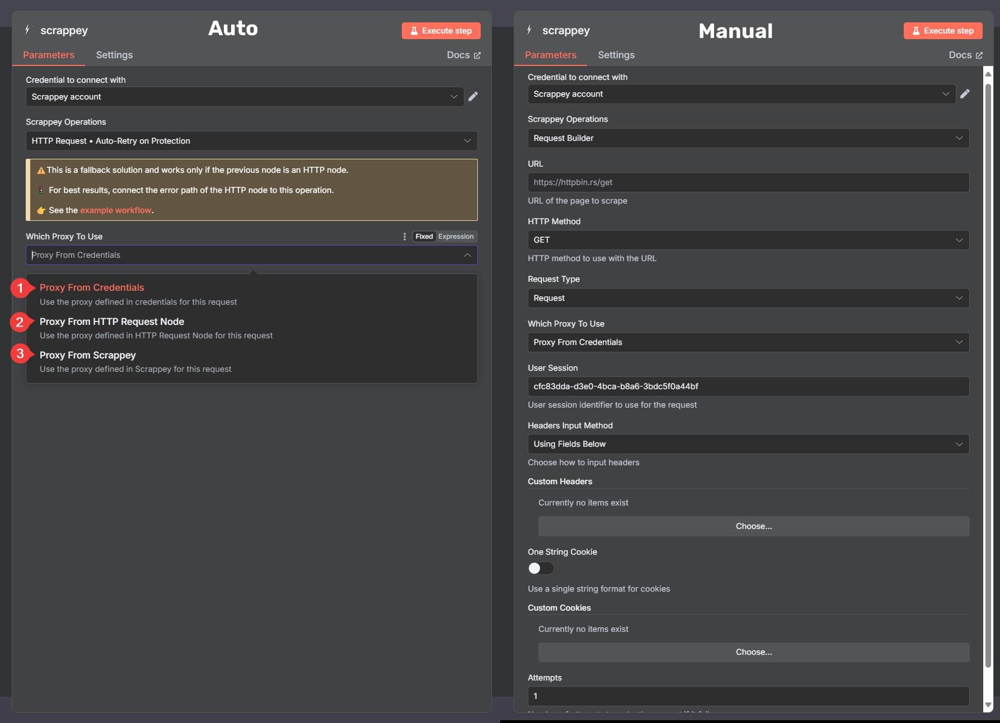
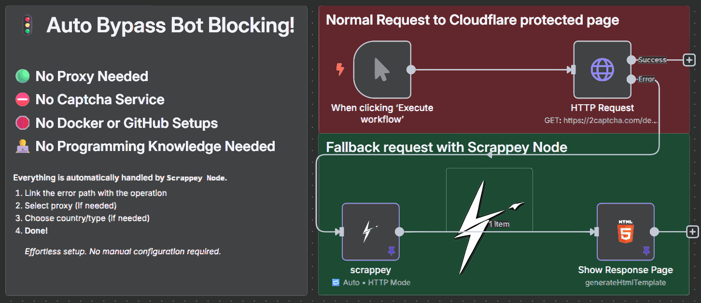

# Scrappey n8n Node

[](https://github.com/Automations-Project/n8n-nodes-scrappey/actions/workflows/ci.yml)
[](https://github.com/Automations-Project/n8n-nodes-scrappey/actions/workflows/release.yml)
[](https://github.com/Automations-Project/n8n-nodes-scrappey)
[](LICENSE.md)

> 🚀 **Advanced web scraping and anti-bot bypass node for n8n workflows**

A powerful n8n community node that integrates with the [Scrappey.com API](https://scrappey.com) to provide advanced web scraping capabilities with built-in anti-bot protection bypass. Perfect for automating data extraction from protected websites, handling CAPTCHAs, and managing complex browser interactions.

## ✨ Key Features

### 🛠️ **Three Operation Modes**

1. **Request Builder** - Create fully customized HTTP/browser requests with granular control
2. **HTTP Auto-Retry** - Automatically retry failed HTTP requests through Scrappey's anti-bot network
3. **Browser Auto-Retry** - Advanced browser-based retry with full anti-bot protection

### 🔒 **Anti-Bot Protection Bypass**

- **Cloudflare** challenge solving
- **Datadome** bypass capabilities
- **hCaptcha & reCAPTCHA** automatic solving
- **JavaScript-heavy websites** full browser simulation
- **Mouse movement simulation** for enhanced stealth

### 🌍 **Advanced Proxy Management**

- **Residential proxies** with country targeting
- **Datacenter proxies** for fast requests
- **Mobile proxies** for mobile-specific content
- **Custom proxy** support (SOCKS4/5, HTTP/HTTPS)
- **150+ countries** available for geo-targeting

### ⚙️ **Flexible Configuration**

- **Multiple request types**: Standard HTTP, Browser, Patched Chrome
- **Custom headers & cookies** with field-based or JSON input
- **Session management** for maintaining state across requests
- **POST/PUT/PATCH support** with body or form parameters
- **CSS selector waiting** for dynamic content
- **XHR/Fetch interception** for API data extraction

## 🚀 Installation

### Method 1: n8n Community Nodes (Recommended)

1. Open your n8n instance
2. Go to **Settings** → **Community Nodes**
3. Enter: `@automations-project/n8n-nodes-scrappey`
4. Click **Install**

### Method 2: Manual Installation

```bash
# Using npm
npm install @automations-project/n8n-nodes-scrappey

# Using pnpm
pnpm add @automations-project/n8n-nodes-scrappey

# Using yarn
yarn add @automations-project/n8n-nodes-scrappey
```

### Method 3: Development Installation

```bash
# Clone the repository
git clone https://github.com/Automations-Project/n8n-nodes-scrappey.git
cd n8n-nodes-scrappey

# Install dependencies
pnpm install

# Build the node
pnpm run build

# Link for development
pnpm run start:dev
```

## 🔧 Configuration

### 1. Set Up Scrappey API Credentials

1. Sign up at [Scrappey.com](/#) to get your API key.
2. In n8n, create new **Scrappey API** credentials
3. Enter your API key and optional proxy settings
   > 🎯 **Get Started Free!** Try Scrappey with **750 Direct requests** and **150 Browser requests** at no cost.  
   > [Start your free trial →](https://nodes.n8n.community/scrappey/signup)
   >
   > **Affordable scaling**: For just €100, you can get 600,000 request credits including proxies, captcha etc...

### 2. Credential Options

- **API Key** (required): Your Scrappey.com API key
- **Custom Proxy** (optional): Your own proxy URL (SOCKS4/5, HTTP/HTTPS)
- **Whitelisted Domains** (optional): JSON array of allowed domains for enhanced security

## 📋 Operation Modes

### 🛠️ Request Builder (Manual)

**Primary mode for creating custom requests with full control**

```typescript
// Example configuration options:
{
  "url": "https://example.com/api/data",
  "httpMethod": "GET",
  "request_type": "Browser", // or "Request", "PatchedChrome"
  "whichProxyToUse": "proxyFromScrappey",
  "proxyType": "residential", // residential, datacenter, mobile
  "customProxyCountry": "UnitedStates",
  "antibot": true,
  "mouseMovements": true,
  "datadome": true
}
```

**Use Cases:**

- Complex form submissions with CAPTCHA solving
- JavaScript-heavy SPA scraping
- API data extraction with anti-bot protection
- Multi-step workflows with session management

### 🔁 HTTP Auto-Retry

**Fallback solution for failed n8n HTTP Request nodes**

Connect the **error output** (red connector) of a standard HTTP Request node to this operation. It automatically retries the same request through Scrappey's network when blocked by:

- Cloudflare challenges
- Rate limiting
- IP blocks
- Basic anti-bot measures


### 🌐 Browser Auto-Retry

**Advanced browser-based retry with full anti-bot protection**

Similar to HTTP Auto-Retry but uses a full browser environment with:

- Automatic CAPTCHA solving (hCaptcha, reCAPTCHA)
- Mouse movement simulation
- Datadome bypass enabled
- JavaScript execution
- 3 automatic retries

## 💡 Usage Examples

### Basic Web Scraping

```javascript
// Request Builder - Simple GET request
{
  "operation": "requestBuilder",
  "url": "https://httpbin.org/get",
  "httpMethod": "request.get",
  "request_type": "Request"
}
```

### Advanced Browser Automation

```javascript
// Browser request with anti-bot protection
{
  "operation": "requestBuilder",
  "url": "https://protected-site.com",
  "request_type": "Browser",
  "antibot": true,
  "mouseMovements": true,
  "datadome": true,
  "cssSelector": ".content-loaded",
  "proxyType": "residential",
  "customProxyCountry": "UnitedStates"
}
```

### Form Submission with CAPTCHA

```javascript
// POST request with CAPTCHA solving
{
  "operation": "requestBuilder",
  "url": "https://example.com/submit",
  "httpMethod": "request.post",
  "request_type": "Browser",
  "bodyOrParams": "body_used",
  "body_for_request": "{\"name\":\"John\",\"email\":\"john@example.com\"}",
  "antibot": true
}
```

### Auto-Retry Fallback

```javascript
// Connect HTTP Request node error output to Scrappey node input
// Set operation to "httpRequestAutoRetry" or "httpRequestAutoRetryBrowser"
{
  "operation": "httpRequestAutoRetry",
  "whichProxyToUse": "proxyFromScrappey",
  "proxyType": "residential"
}
```

## 🔒 Error Handling

The node provides detailed error messages for common Scrappey API error codes:

| Code      | Description        | Solution                            |
| --------- | ------------------ | ----------------------------------- |
| CODE-0001 | Server overloaded  | Retry after a few minutes           |
| CODE-0002 | Cloudflare blocked | Try different proxy or browser mode |
| CODE-0003 | Too many attempts  | Wait before retrying                |
| CODE-0004 | Invalid command    | Check request configuration         |
| CODE-0005 | Tunnel failed      | Retry with different proxy          |

## 🏗️ Development

### Building from Source

```bash
# Install dependencies
pnpm install

# Development build with watch
pnpm run build:watch

# Production build
pnpm run build

# Linting & formatting
pnpm run lint
pnpm run format

# Type checking
pnpm run type-check

# Full validation
pnpm run validate
```

### Project Structure

```
n8n-nodes-scrappey/
├── nodes/Scrappey/          # Main node implementation
│   ├── Scrappey.node.ts     # Node definition and execution
│   ├── execute.ts           # Operation dispatcher
│   ├── RequestMethods.ts    # HTTP/Browser request handlers
│   ├── requestBodyBuilder.ts # Request body construction
│   ├── fields.ts            # Node field definitions
│   ├── GenericFunctions.ts  # API integration utilities
│   └── utils.ts             # Helper functions
├── credentials/             # Credential definitions
│   └── ScrappeyApi.credentials.ts
├── scripts/                 # Build and deployment scripts
├── .github/workflows/       # CI/CD pipelines
└── dist/                    # Built output
```

### CI/CD Pipeline

This project includes a comprehensive CI/CD setup:

- **Continuous Integration**: Automated testing, linting, and building on every PR
- **Auto-versioning**: Automatic version bumps based on commit messages
- **Automated Releases**: Publishes to GitHub Packages and optionally npm
- **Security Scanning**: CodeQL analysis and dependency auditing
- **Dependabot**: Automated dependency updates

#### Commit Message Conventions

- `feat: description` → Minor version bump
- `fix: description` → Patch version bump
- `BREAKING CHANGE` or `[major]` → Major version bump
- `[skip ci]` or `[skip version]` → Skip automation

## 🤝 Contributing

1. Fork the repository
2. Create a feature branch: `git checkout -b feature/amazing-feature`
3. Commit changes: `git commit -m 'feat: add amazing feature'`
4. Push to branch: `git push origin feature/amazing-feature`
5. Open a Pull Request

## 📄 License

This project is licensed under the MIT License - see the [LICENSE.md](LICENSE.md) file for details.

## 🔗 Links

- **Scrappey Website**: [https://scrappey.com](https://scrappey.com)
- **Scrappey Documentation**: [https://wiki.scrappey.com](https://wiki.scrappey.com)
- **n8n Community**: [https://community.n8n.io](https://community.n8n.io)
- **GitHub Issues**: [Report bugs or request features](https://github.com/Automations-Project/n8n-nodes-scrappey/issues)
- **Nskha Discord**: [⚠️Incative community](https://nskha.com/discord)

---

**Made with ❤️ for the n8n community**
