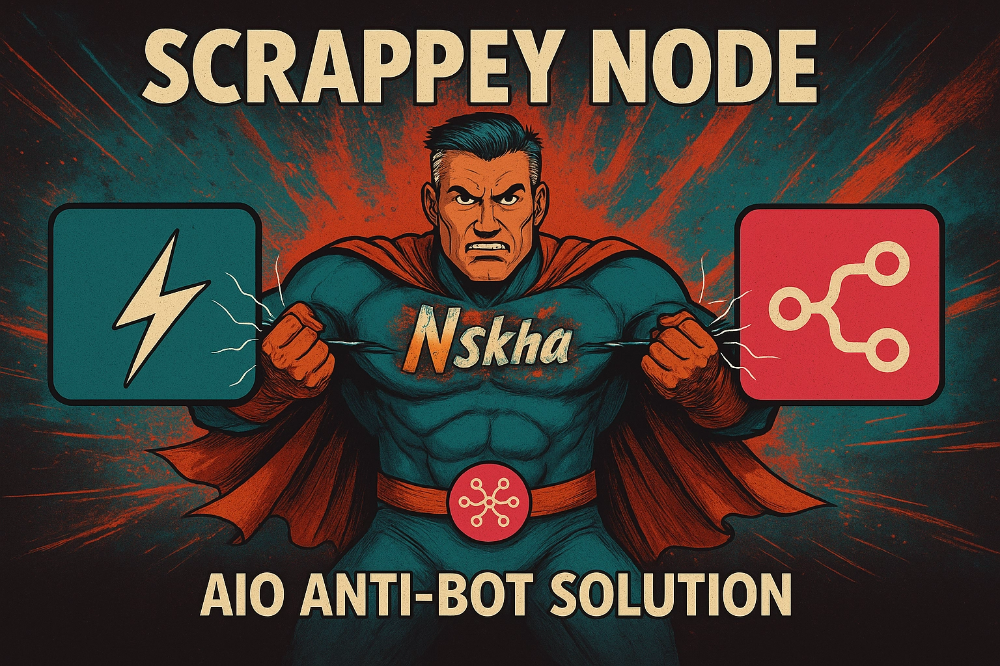

Scrappey n8n Node

Welcome to the official documentation for the Scrappey node for n8n. This node empowers your workflows to make advanced, resilient web requests and bypass sophisticated anti-bot protections using the Scrappey.com API.

Whether you need to perform simple GET requests or execute complex browser-based scraping with automated CAPTCHA solving, this node provides a robust set of tools to get the data you need.
Features

    Multiple Operation Modes: Choose between a flexible Request Builder or two powerful auto-retry modes for handling failed requests from standard n8n nodes.

    Anti-Bot Bypass: Seamlessly handle Cloudflare, Datadome, hCaptcha, and reCAPTCHA challenges.

    Flexible Proxy Management: Utilize proxies from your Scrappey account, define them in credentials, or pass them from a previous HTTP Request node.

    Advanced Browser Simulation: Go beyond standard HTTP requests by simulating real browser actions, including mouse movements, for websites that rely on JavaScript.

    Detailed Request Customization: Fine-tune every aspect of your request, including HTTP methods, headers, cookies, and post data.

    Built-in Error Handling: The node provides clear, specific error messages for Scrappey API error codes to simplify debugging.

Prerequisites

Before using this node, you must have a Scrappey account and an API key.

    Sign up on Scrappey.com.

    Find your API key in your account dashboard.

    Add your API key to the scrappeyApi credentials in your n8n instance.

Operations

The Scrappey node offers three distinct operations to suit different use cases.
1. Request Builder

This is the primary mode for creating highly customized requests directly within the node. It's the most flexible option, giving you granular control over every aspect of the web request.

Key Configuration Options:

    Request Type:

        Request: Makes a standard HTTP request. It's fast and efficient for accessing APIs or static content.

        Browser: Simulates a real web browser (Chromium). Use this for scraping dynamic websites that render content using JavaScript.

        Patched Chrome Browser: A specialized browser option for advanced use cases.

    URL & HTTP Method: Specify the target URL and the HTTP method (GET, POST, PUT, etc.).

    Proxy Options:

        Which Proxy To Use:

            Proxy From Credentials: Uses the proxy URL defined in your scrappeyApi credentials.

            Proxy From Scrappey: Leverages Scrappey's proxy pool (Residential, Datacenter, Mobile) and allows for country-specific geo-targeting.

            Proxy From HTTP Request Node: (For fallback modes) Uses the proxy from the preceding failed HTTP node.

    Headers & Cookies: Add custom headers and cookies to your request using either key-value fields or a raw JSON object.

    Body & Params: For POST, PUT, and PATCH requests, you can define the request body (e.g., as JSON) or send the data as URL-encoded parameters.

    User Session: Maintain a consistent session for a series of requests.

    Advanced Browser Settings (for Browser Request Type):

        Antibot: Automatically enables solvers for hCaptcha and reCAPTCHA.

        Add Random mouse movement: Simulates human-like mouse movements to appear less like a bot.

        CSS Selector: Wait for a specific element to appear on the page before returning the content.

        Intercept XHR/Fetch Request: Instead of returning the page's HTML, capture and return the response of a specific background API call made by the page.

2. HTTP Request • Auto-Retry on Protection

This operation acts as a fallback for n8n's native HTTP Request node. If a standard HTTP request fails due to anti-bot protection (like a Cloudflare challenge page), you can route its error output to this Scrappey operation.

It automatically re-submits the exact same request (including URL, method, headers, and body) through the Scrappey API, which is designed to handle the protection and retrieve the actual page content.

How to Use:

    Create a standard n8n HTTP Request node.

    Connect its error output (the red dot) to the input of the Scrappey node.

    In the Scrappey node, select the HTTP Request • Auto-Retry on Protection operation.

    Configure the desired Proxy Type and Custom Proxy Country if you wish to use Scrappey's proxy network for the retry.

    👉 See the Example Workflow for a practical demonstration.

3. Browser Request • Auto-Retry & Anti-Bot

This is the most powerful fallback operation. Like the previous mode, it's designed to be connected to the error output of a failed HTTP Request node.

However, instead of making a simple HTTP request, it retries the failed request using a full browser simulation. This approach is highly effective against advanced anti-bot systems that require JavaScript execution or analyze browser fingerprints. It automatically enables:

    Datadome Bypass: True

    Mouse Movements: True

    Automatic Captcha Solving: True

    3 Retries by default.

How to Use:
This mode is configured identically to the HTTP Request • Auto-Retry operation. Simply connect the error output of a failing node and select this operation for a robust, browser-based retry.
License

This project is licensed under the MIT License.